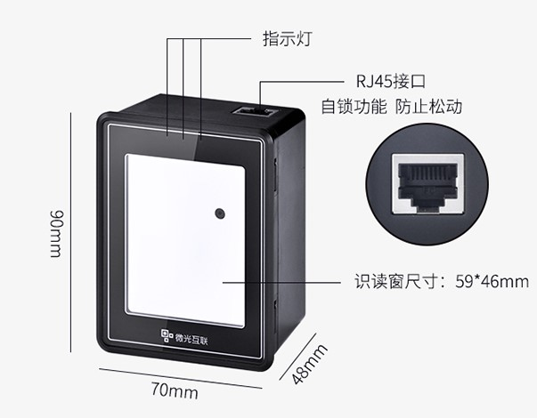
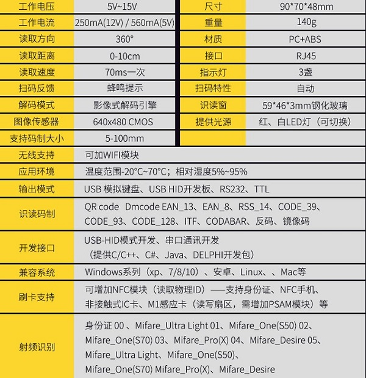
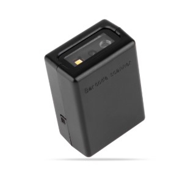
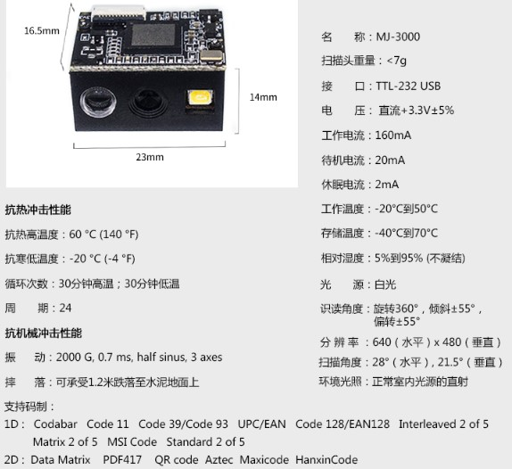
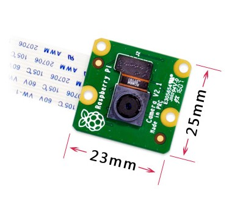
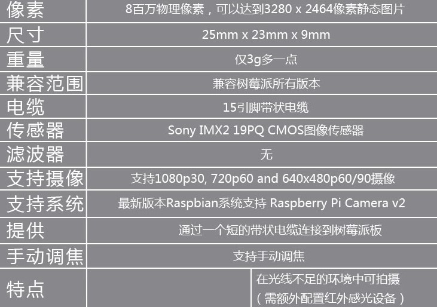

# 《二维码扫描控制方案初探》

## 一、方案目的：

​	**近年来，二维码技术已经非常的成熟，而二维码识别技术的应用也越加的广泛，比如地铁站的二维码扫码进站、二维码储物柜、二维码扫码支付以及二维码储物柜等，已经在我们的生活中越加普及。它和指纹识别、人脸识别技术，一起成为了当前应用最广泛，也最实用的控制系统识别技术。通过这些识别技术与控制技术的融合，使得生活变得更加智能，也使终端的响应控制更加便捷。当然，也更加成熟。**

​	**此次，我们将首先对二维码的识别模块进行简单介绍，并利用这些模块逐步进行二维码识别控制的方案介绍，并将以此参考。**

## 二、扫描模组：

### 模组一：外嵌式二维码扫描模组

* **样图：**  
* **参数**：
* **该模组常见于超市的支付宝、微信收款盒子，最近也开始应用于地铁站进站通道的扫码门禁。能够对手机、纸质、塑料甚至是变形、污损的各种二维码进行精准扫描。并且支持WIFI、RS232、TTL、USB的输出。**
* [链接地址](<https://item.taobao.com/item.htm?id=584987026164&ali_refid=a3_430582_1006:1121680077:N:rY%2Bzlv6%2Bwz5HAEtVDyCQKaUNyWtqwPz%2B:bccc61ec594dc587dc217a68374f8232&ali_trackid=1_bccc61ec594dc587dc217a68374f8232&spm=a230r.1.14.11#detail>)

### 模组二：枪式（固定式）扫描模组

* **样图：**
* **参数：**
* **该模块，较常见于枪式二维码扫描器中，常用于超市的支付扫描等。它与模组一没有太大的区别，都是采用了影像式扫描解码引擎，最明显的区别是不同的体型下所对应的不同应用场景。**
* [链接地址1](<https://item.taobao.com/item.htm?id=541597165797&ali_refid=a3_420434_1006:1104095510:N:9%2B6dLe5zpHO%2FcgsXBziEfbhdsOn917cy:e12b163c41a4d0469d26fab54b85b18a&ali_trackid=1_e12b163c41a4d0469d26fab54b85b18a&spm=a230r.1.1957635.37>)、[连接地址2](<https://detail.tmall.com/item.htm?spm=a230r.1.14.184.2759700bUhONXP&id=533047082164&ns=1&abbucket=12>)

### 模组三：OpenCV摄像头模块

* **样图：**
* **参数：**

* **当然！除了采用成熟的扫描模组外，还可以直接采用摄像头以及开发环境下的工具包，来进行图像下的二维码识别，这种方式较为开源。但是相比前两种模组的应用，稳定性可能不是那么出色。**

### 三、二维码的识别：

​	**对于前两种模组的识别应用，只需使用配套的相关资料和应用，便可轻松将识别的二维码信息并通过串口输出至终端，并通过终端平台的脚本进行数据入库和判断，进而实现响应控制。**

​	**而第三种模组，则需要应用相关的Python开源工具包“zbar-tools”来进行脚本编写，来实现对二维码的信息识别与输出。具体可参考以下链接中的内容资料：[参考一](http://ju.outofmemory.cn/entry/362681)。**

### 四、实施讨论：

​	**通过这些模块，我们可以利用树莓派等终端下的Linux等平台，首先进行环境的搭建，再进行二维码的识别信息输出（或python下的识别脚本编写），我们将识别到的二维码信息存入本地或云端的数据库中，并从数据库中导出数据，在本地或云端通过脚本进行比对分析，如果判断为有效数据，则进行继电器下电磁阀等门禁电路的电平输出，进而实现系统控制。**

​	**当然，这其中还会包括二维码的生成，否则就没有进行匹配比对的数据进行正确身份的识别，而整个系统功能也将无从实现。所以，这就需要考虑到对二维码生成工具API的调用，或者直接使用开源的APP进行二维码生成，这就需要从应用层面进行考虑了，比如使用微信小程序或者是手机APP，甚至是前端WEB随机生成。但无论如何，这些随机产生的二维码数据同样需要进入数据库中用于后续身份验证的比对参考，这同样需要进行进一步的考虑。**

​	**这个系统的设计，无论是从底层识别模块的选取，到识别数据的入库，还是到上层二维码的生成、入库与数据比对，以及最终控制系统的形式及场景，都需要从最终的应用层角度去考虑，需要进一步的讨论与探索。**